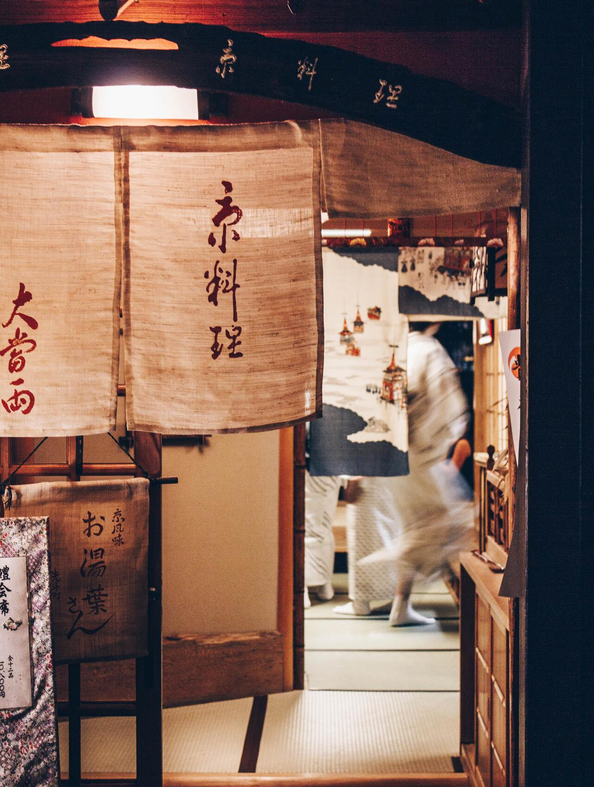

# 첫인상

<time>27 Feb 2023 11:40</time>

<cap>Photo by Dale Scogings on Unsplash</cap>

나는 첫인상을 믿지 않았다. 몇 초, 행동 몇 가지, 말 몇 마디로 수십 년 동안 살아온 한 사람의 인생을 어떻게 이해할 수 있을까.

오늘 먹은 점심은 결론부터 이야기하자면 별로 맛이 없었다. 친구와 2층의 포케집과 3층의 일식집 중 고민하다가, 가위바위보로 3층에 들어가기로 결정했다. 문을 열고 들어가려는 찰나, '다른데 갈까?' 하는 생각이 불현듯 스쳤다. 지저분한 타일 바닥과 깔끔하지 않은 매장 상태. 애매한 인테리어와 분위기에 어울리지 않는 배경음악이 나를 망설이게 만들었다. 내가 시킨 부타동과 친구가 시킨 나가사키 짬뽕을 한 입 먹은 순간 역시는 역시, '이 가게에 들어오지 말 걸' 했다. 이 가게의 첫인상과 내가 먹은 음식의 맛이 어느 정도 느낌이 비슷하다는 생각이 들었다.

그날 계속 놀다가 저녁을 먹으러 갔는데, 그곳은 입구부터 보기 좋고 들어가고 싶게 생겼었다. 실제 들어갔을 때도 굉장히 맛있는 집이었다.

첫인상으로 이 사람의 인생 전체를 판단하는 것은 힘들다고 생각하지만, 이런 경험을 계속 하다 보니, 이 사람과 지내는 첫 몇일 간의 “느낌”이 어떻게 될지는 알 수 있다고 생각을 바꾸게 된 것 같다. 나에게 있어서 깨끗하고 정돈된 매장은 무엇일까. 내 블로그의 첫인상은 어때야 할까, 각 글들의 첫 인상은 어때야 할까. 내 코드의 첫인상은 어때야 할까. 점심에 지불한 일만 천원으로 생각해볼 수 있는 괜찮은 교훈이었던 것 같다.

---

내가 블로그에 글을 쓰는 이유는 다음과 같다. 내가 글을 쓰며 성장하는 동시에, 글을 읽는 다른 사람이 성장하는 좋은 방법이며, 쓰는 현재에도 개념이나 생각을 정리할 수 있어 이득이며, 미래에 내가 다시 보면 기억을 되살릴 수 있어 미래에도 이득이라고 생각하기 때문이다. 나에게도 좋고 남에게도 좋고, 현재에도 좋고 미래에도 좋은 일을 마다할 이유가 있는가?

내 블로그의 첫 인상은 이해하기 쉽고, 유익하고, 재미있었으면 한다. 오늘 하루도 책상을 잘 정돈하고 용모를 단정히 하고 책상 앞에 앉아 진득하게 실력을 쌓아 보겠다. 내 블로그의 첫 인상이 그랬으면 좋겠다는 마음을 글에 담아 본다.

